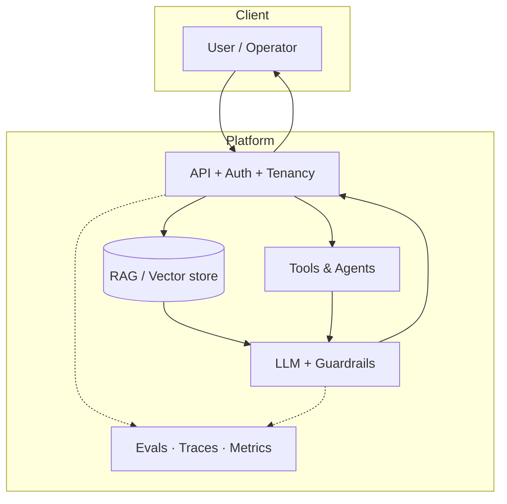

<div align="center">


<br/>


<br/><br/>


<br/>

**AI engineer · intelligent systems in production**

<br/>

<sub>
  I build assistants, retrieval, and agentic workflows for real users — measurable quality, predictable latency,<br/>
  and failure modes teams can own, iterate on, and tie to business outcomes.
</sub>

<br/><br/>

<a href="https://nikeshh.com"></a>
<a href="https://www.linkedin.com/in/nikeshh/"></a>
<a href="https://x.com/NikeshhV"></a>
<a href="mailto:admin@nikeshh.com"></a>

<br/><br/>


</div>

---


```yaml
role:         Lead AI & Full Stack Developer @ RBC
location:     Remote-first · overlap US & EU
building:     Enterprise AI · RAG · agents · full-stack platforms
writing:      nikeshh.com/blog
availability: Open to selective AI & platform work · Q2 2026
```

<br/>

<table align="center">
<tr>
<td align="center" width="33%">
<br/>
<sub><b>RBC</b> · 2022 — Present</sub><br/>
<sub>Lead AI & Full Stack</sub>
</td>
<td align="center" width="33%">
<br/>
<sub><b>Temenos</b> · 2019 — 2022</sub><br/>
<sub>Senior SWE → Intern</sub>
</td>
<td align="center" width="33%">
<sub><b>7+ years</b> shipping</sub><br/>
<sub>banking · fintech · platforms</sub><br/>
<sub>prototype → production</sub>
</td>
</tr>
</table>

---


<table>
<tr>
<td width="50%" valign="top">

**🛟 Customer support copilot**  
Grounded assistants over policies & ticket history — human review, audit trails, measurable quality.

**📚 Knowledge & RAG**  
Retrieval with citations, freshness checks, and evals — answers teams trust in prod, not demo search.

</td>
<td width="50%" valign="top">

**⚡ Sales & ops automation**  
Agentic workflows across CRM & internal tools — enrichment, routing, handoffs.

**🧩 Full-stack product**  
UX → APIs → data models → auth & perf — coherent products, not disjoint tickets.

</td>
</tr>
</table>

<br/>



<p align="center"><sub>How I think about production AI — grounded context, bounded tools, observable by default.</sub></p>

---


<table>
<tr>
<th align="left">Project</th>
<th align="left">One line</th>
<th align="center">Read</th>
</tr>
<tr>
<td><b>Enterprise AI assistant</b><br/><sub>LLM · RAG · Enterprise</sub></td>
<td>Governed, multi-tenant assistant with grounded answers and audit trails.</td>
<td align="center"><a href="https://nikeshh.com/portfolio/enterprise-ai-assistant"><b>→</b></a></td>
</tr>
<tr>
<td><b>Realtime ops platform</b><br/><sub>Platform · Realtime</sub></td>
<td>One pane of glass for incidents — live signals, runbooks, and actions.</td>
<td align="center"><a href="https://nikeshh.com/portfolio/realtime-ops-platform"><b>→</b></a></td>
</tr>
<tr>
<td><b>ML feature platform</b><br/><sub>ML · Platform</sub></td>
<td>Shared catalog, batch + online serving, and lineage you can trust.</td>
<td align="center"><a href="https://nikeshh.com/portfolio/ml-feature-platform"><b>→</b></a></td>
</tr>
</table>

<p align="center">
  <a href="https://nikeshh.com/portfolio"></a>
</p>

---


| Article | Topic |
|---------|--------|
| [Production LLMs: what actually matters before you scale](https://nikeshh.com/blog/production-llms-what-matters) | Latency, evals, governance |
| [RAG without regret: a pragmatic checklist](https://nikeshh.com/blog/rag-pragmatic-checklist) | Retrieval you can debug |
| [Leading AI teams when the roadmap keeps changing](https://nikeshh.com/blog/leading-ai-teams-roadmap-chaos) | Roadmaps & trade-offs |
| [From notebook to on-call: earning trust in ML systems](https://nikeshh.com/blog/notebook-to-oncall) | Handoff & operability |

<p align="center">
  <a href="https://nikeshh.com/blog"></a>
</p>

---


<p align="center">
  <a href="https://nikeshh.com/expertise/ai-ml-engineering"></a>
  <a href="https://nikeshh.com/expertise/full-stack-platforms"></a>
  <a href="https://nikeshh.com/expertise/technical-leadership"></a>
</p>

---


<p align="center">
  <a href="https://skillicons.dev">
    
  </a>
</p>

| Layer | Technologies & focus |
|:------|:---------------------|
| **AI systems** | LLMs · RAG & retrieval · agents & tools · evals & observability |
| **Product code** | TypeScript · Python · Next.js · React · Node |
| **Data & infra** | PostgreSQL · Kubernetes · Docker · AWS / GCP / Azure |
| **Platform** | APIs · event-driven systems · technical leadership |

<details>
<summary><b>Also experienced with</b></summary>
<br/>

Vue · Angular · Java · Spring Boot · MongoDB · Redis · Kafka · Terraform · Prometheus · Grafana · PyTorch · scikit-learn · Flutter · and the long tail of shipping in enterprise environments.

</details>

---


| | Step | |
|:---:|:---|:---:|
| **01** | **Promise first** — user-visible outcome, constraints, risk profile | 🎯 |
| **02** | **Design the system** — LLM vs RAG vs tools; budgets & quality targets | 🏗️ |
| **03** | **Thin slice → harden** — evals, observability, guardrails, failure modes | 🛡️ |
| **04** | **Measure & hand off** — latency, cost, quality; runbooks teams can own | 📈 |

> *"Building calm, reliable intelligent products."* — [nikeshh.com](https://nikeshh.com)

---


<div align="center">


<br/>


</div>

<br/>

<!-- Snake: add .github/workflows/snake.yml in your profile repo — see https://github.com/Platane/snk -->


<details>
<summary><b>Recent activity</b></summary>
<br/>

<!--START_SECTION:activity-->
<!--END_SECTION:activity-->

</details>

---

<div align="center">


<br/>

**Let's build something that holds up in production.**

<br/>

<a href="https://nikeshh.com"></a>
<a href="mailto:admin@nikeshh.com"></a>

<br/><br/>

<sub>⭐️ From <a href="https://github.com/Nikeshh">Nikeshh</a> · Crafted to match <a href="https://nikeshh.com">nikeshh.com</a></sub>

</div>
