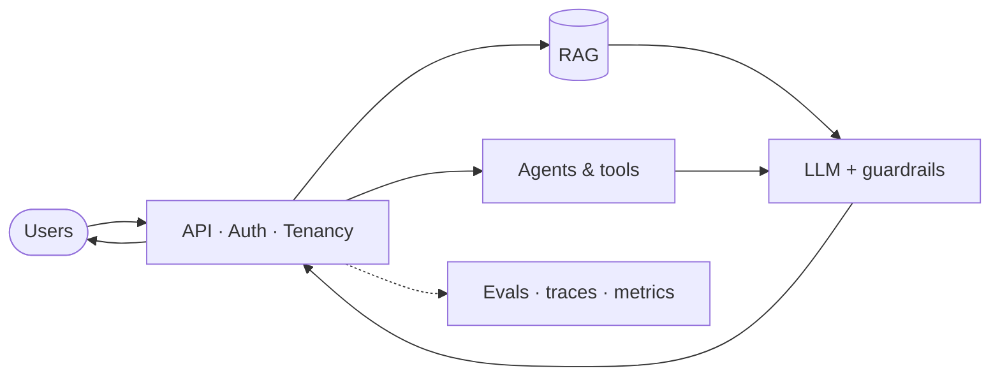

<div align="center">


<br/>


<br/>


<br/>

### AI engineer · intelligent systems in production

I build **assistants**, **retrieval**, and **agentic workflows** for real users —<br/>
measurable quality, predictable latency, and failure modes teams can own.

<br/>

[](https://nikeshh.com)
[](https://www.linkedin.com/in/nikeshh/)
[](https://x.com/NikeshhV)
[](mailto:admin@nikeshh.com)

<br/>


</div>

---

## Now

```yaml
role:         Lead AI & Full Stack Developer @ RBC
was:          Senior Software Engineer @ Temenos (2019 – 2022)
location:     Remote-first · overlap US & EU
focus:        Enterprise AI · RAG · agents · full-stack platforms
writing:      https://nikeshh.com/blog
open_to:      Selective AI & platform work · Q2 2026
```

<div align="center">

<table>
<tr>
<td align="center" width="33%">
<br/>
<b>RBC</b> · 2022 — present<br/>
<sub>Lead AI & Full Stack</sub>
</td>
<td align="center" width="33%">
<br/>
<b>Temenos</b> · 2019 — 2022<br/>
<sub>Senior SWE → Intern</sub>
</td>
<td align="center" width="33%">
<b>7+ years</b> shipping<br/>
<sub>banking · fintech · platforms</sub><br/>
<sub>prototype → production</sub>
</td>
</tr>
</table>

</div>

---

## What I build

<table>
<tr>
<td width="50%" valign="top">

#### Customer support copilot
Grounded assistants over policies & ticket history — human review, audit trails, measurable quality.

#### Knowledge & RAG
Retrieval with citations, freshness checks, and evals — answers teams trust in production.

</td>
<td width="50%" valign="top">

#### Sales & ops automation
Agentic workflows across CRM & internal tools — enrichment, routing, clean handoffs.

#### Full-stack product
UX → APIs → data → auth & performance — coherent products, not disjoint tickets.

</td>
</tr>
</table>



<p align="center"><i>Grounded context · bounded tools · observable by default.</i></p>

---

## Selected work

| Project | Summary | |
|:--------|:--------|:-:|
| **Enterprise AI assistant** | Governed, multi-tenant assistant with grounded answers and audit trails. | [↗](https://nikeshh.com/portfolio/enterprise-ai-assistant) |
| **Realtime ops platform** | One pane of glass for incidents — live signals, runbooks, and actions. | [↗](https://nikeshh.com/portfolio/realtime-ops-platform) |
| **ML feature platform** | Shared catalog, batch + online serving, and lineage you can trust. | [↗](https://nikeshh.com/portfolio/ml-feature-platform) |

[](https://nikeshh.com/portfolio)

---

## Writing

| Essay | |
|:------|:--|
| [Production LLMs: what actually matters before you scale](https://nikeshh.com/blog/production-llms-what-matters) | Latency · evals · governance |
| [RAG without regret: a pragmatic checklist](https://nikeshh.com/blog/rag-pragmatic-checklist) | Retrieval you can debug |
| [Leading AI teams when the roadmap keeps changing](https://nikeshh.com/blog/leading-ai-teams-roadmap-chaos) | Roadmaps & trade-offs |
| [From notebook to on-call: earning trust in ML systems](https://nikeshh.com/blog/notebook-to-oncall) | Handoff & operability |

[](https://nikeshh.com/blog)

---

## Expertise

[](https://nikeshh.com/expertise/ai-ml-engineering)
[](https://nikeshh.com/expertise/full-stack-platforms)
[](https://nikeshh.com/expertise/technical-leadership)

---

## Stack

<p align="center">
  
</p>

| Layer | Focus |
|:------|:------|
| **AI systems** | LLMs · RAG · agents · evals & observability |
| **Product** | TypeScript · Python · Next.js · React · Node |
| **Infra** | PostgreSQL · Kubernetes · Docker · AWS / GCP / Azure |
| **Platform** | APIs · event-driven design · technical leadership |

<details>
<summary><b>Also experienced with</b></summary>
<br/>
Vue · Angular · Java · Spring Boot · MongoDB · Redis · Kafka · Terraform · Prometheus · Grafana · PyTorch · scikit-learn
</details>

---

## How I ship

| | |
|:-:|:-|
| **01 · Promise** | User outcome, constraints, and risk profile first |
| **02 · Design** | LLM vs RAG vs tools — budgets and quality targets |
| **03 · Harden** | Evals, observability, guardrails, failure modes |
| **04 · Own** | Latency, cost, quality — runbooks teams can run |

> *"Building calm, reliable intelligent products."* — [nikeshh.com](https://nikeshh.com)

---

## GitHub

<div align="center">


<br/>


<br/>


</div>

<details>
<summary><b>Recent activity</b></summary>
<br/>

<!--START_SECTION:activity-->
<!--END_SECTION:activity-->

</details>

---

<div align="center">

### Let's build something that holds up in production.

[](https://nikeshh.com)
[](mailto:admin@nikeshh.com)

<br/>

<sub>Profile README · <a href="https://github.com/Nikeshh">@Nikeshh</a> · <a href="https://nikeshh.com">nikeshh.com</a></sub>

</div>
